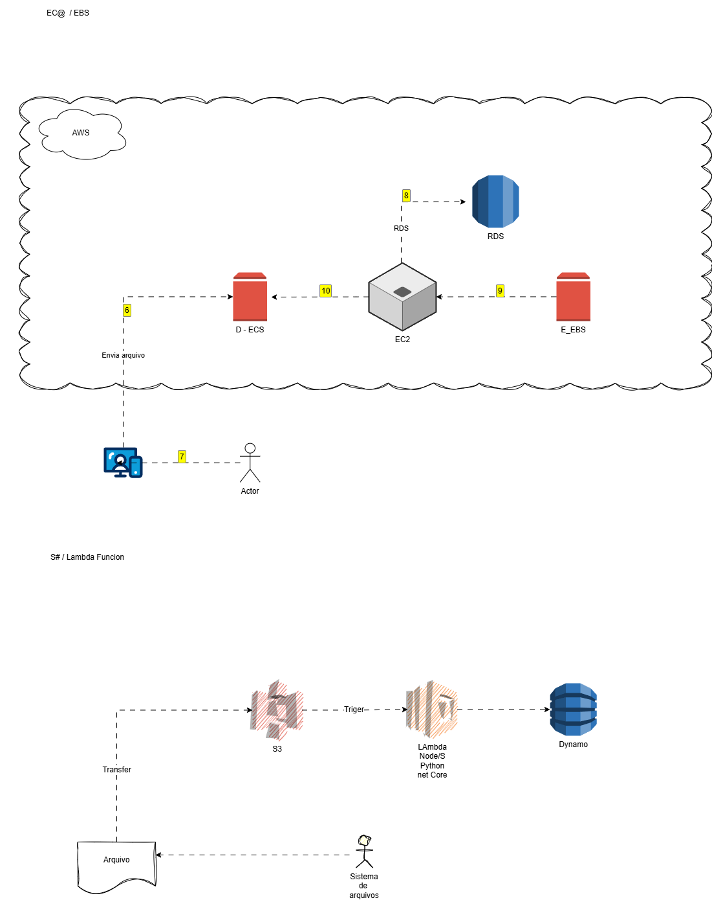

#  Gerenciamento de Instâncias EC2 na AWS

## Sobre o Projeto

Este repositório foi desenvolvido como parte do desafio prático da DIO, com o objetivo de consolidar os conhecimentos sobre documentação de arquiteturas em nuvem utilizando a plataforma Draw.io (diagrams.net).

Durante a atividade, foi criado um diagrama representando a integração entre serviços da AWS, permitindo visualizar a estrutura e o relacionamento entre os componentes da arquitetura.

---

## Objetivos de Aprendizagem

Ao concluir este desafio, foi possível:

* Aplicar conceitos de computação em nuvem em um ambiente prático;
* Compreender a função dos principais serviços AWS utilizados na arquitetura;
* Desenvolver habilidades na criação de diagramas técnicos;
* Documentar soluções de forma clara e organizada;
* Utilizar o GitHub como ferramenta para compartilhamento de documentação técnica.

---

## Projeto Desenvolvido

### Descrição

Neste projeto, foi utilizada a plataforma Draw.io para criar um diagrama de arquitetura AWS, representando a interação entre os serviços Amazon S3, Amazon EC2, AWS Lambda e Amazon EBS. A atividade proporcionou aprendizado sobre documentação visual de soluções em nuvem e melhor compreensão da função de cada componente dentro da arquitetura proposta.

---

## Ferramentas Utilizadas

* Draw.io (Diagrams.net)
* Amazon Web Services (AWS)
* Amazon S3
* Amazon EC2
* AWS Lambda
* Amazon EBS
* Git
* GitHub
* Markdown

---

## Aprendizados

* Compreensão da utilização do Draw.io para criação de diagramas técnicos.
* Entendimento da função do Amazon S3 como serviço de armazenamento em nuvem.
* Conhecimento sobre o Amazon EC2 para execução de aplicações e processamento.
* Aprendizado sobre o uso do AWS Lambda para execução de funções sem gerenciamento de servidores.
* Compreensão do papel do Amazon EBS como armazenamento persistente para instâncias EC2.
* Desenvolvimento de habilidades para documentar arquiteturas em nuvem de forma visual.
* Aplicação de boas práticas na organização e apresentação de documentação técnica.

---

## Desafios Encontrados

* Compreender a função de cada serviço dentro da arquitetura AWS.
* Identificar corretamente o fluxo de comunicação entre os componentes.
* Organizar visualmente os recursos de forma clara e intuitiva.
* Familiarizar-se com as funcionalidades da plataforma Draw.io.
* Representar a arquitetura de maneira objetiva e tecnicamente correta.

---

## Soluções Aplicadas

* Estudo dos conceitos apresentados durante as aulas.
* Utilização dos recursos gráficos do Draw.io para construção da arquitetura.
* Consulta à documentação oficial da AWS para entendimento dos serviços.
* Organização dos componentes utilizando boas práticas de modelagem visual.
* Documentação do processo utilizando GitHub e Markdown.

---

## Evidências da Prática

Durante a realização do desafio foram executadas as seguintes atividades:

* Criação de um diagrama de arquitetura na plataforma Draw.io.
* Modelagem da interação entre Amazon S3, Amazon EC2, AWS Lambda e Amazon EBS.
* Organização visual dos componentes da solução.
* Documentação da arquitetura desenvolvida.
* Publicação do projeto em um repositório GitHub.

### Arquitetura Desenvolvida

> Inserir abaixo a imagem exportada do Draw.io.

```markdown

```

---

## 📂 Estrutura do Repositório

```text
📦 arquitetura-aws-drawio
 ┣ 📂 images
 ┃ ┗ 📜 arquitetura-aws.png
 ┣ 📜 README.md
 ┗ 📜 arquitetura.drawio
```

---

## ☁️ Serviços AWS Representados

### Amazon S3

Serviço de armazenamento de objetos utilizado para armazenamento seguro e escalável de arquivos e dados.

### Amazon EC2

Serviço responsável pelo provisionamento de servidores virtuais na nuvem.

### AWS Lambda

Serviço de computação serverless utilizado para execução de código sob demanda.

### Amazon EBS

Serviço de armazenamento em blocos utilizado para fornecer persistência de dados às instâncias EC2.

---

## Documentação Oficial AWS

### Amazon EC2

https://docs.aws.amazon.com/pt_br/toolkit-for-visual-studio/latest/user-guide/tkv-ec2-ami.html

---

## Materiais Complementares

### GitHub Quick Start

Repositório com materiais introdutórios sobre Git e GitHub.

### GitBook: Formação GitHub Certification

Material textual para aprofundamento nos conceitos da plataforma GitHub.

### Documentação Oficial do GitHub

https://docs.github.com

### GitHub Markdown

https://docs.github.com/pt/get-started/writing-on-github

---

## Conclusão

Este desafio proporcionou uma experiência prática na modelagem de arquiteturas em nuvem utilizando o Draw.io. A atividade permitiu compreender melhor a integração entre diferentes serviços AWS e reforçou a importância da documentação visual para representação e comunicação de soluções tecnológicas.

---

## Autor

**Vanderci Silva**

Projeto desenvolvido como parte dos desafios práticos da DIO.

